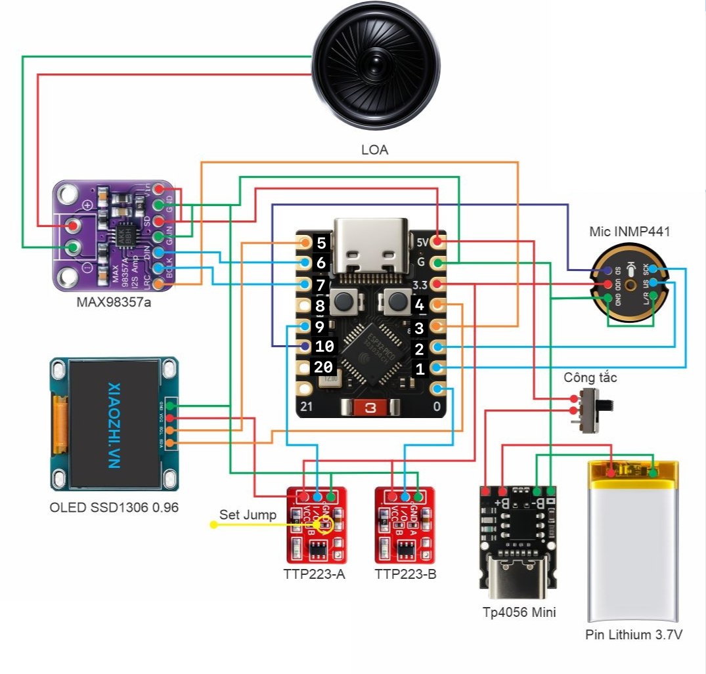
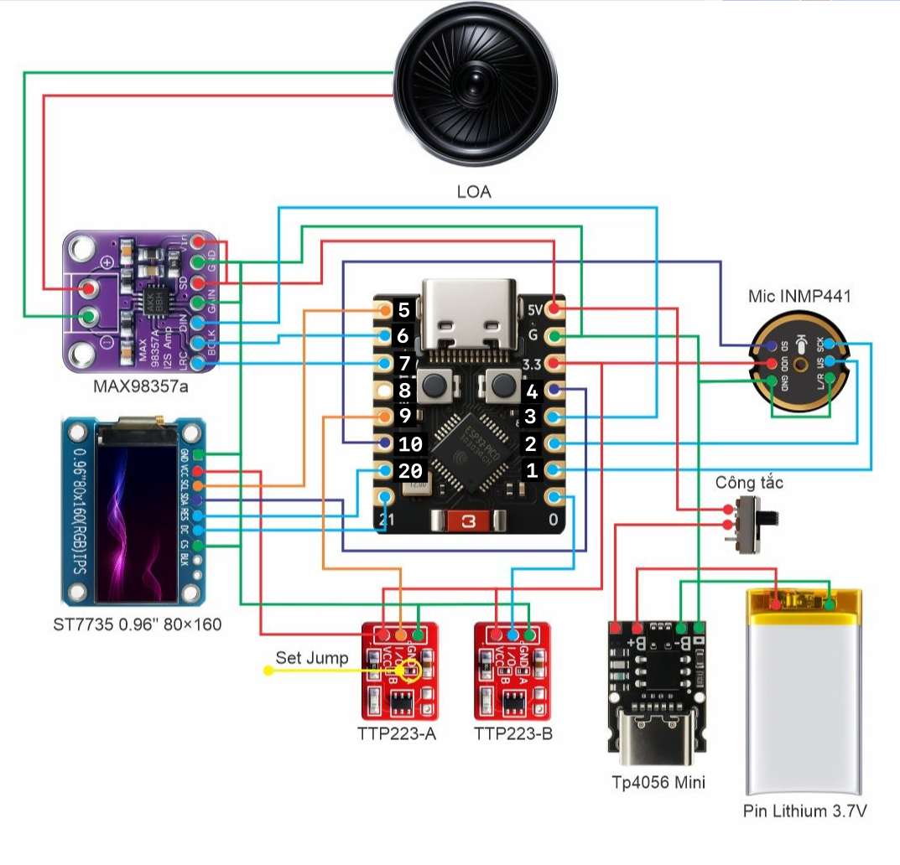
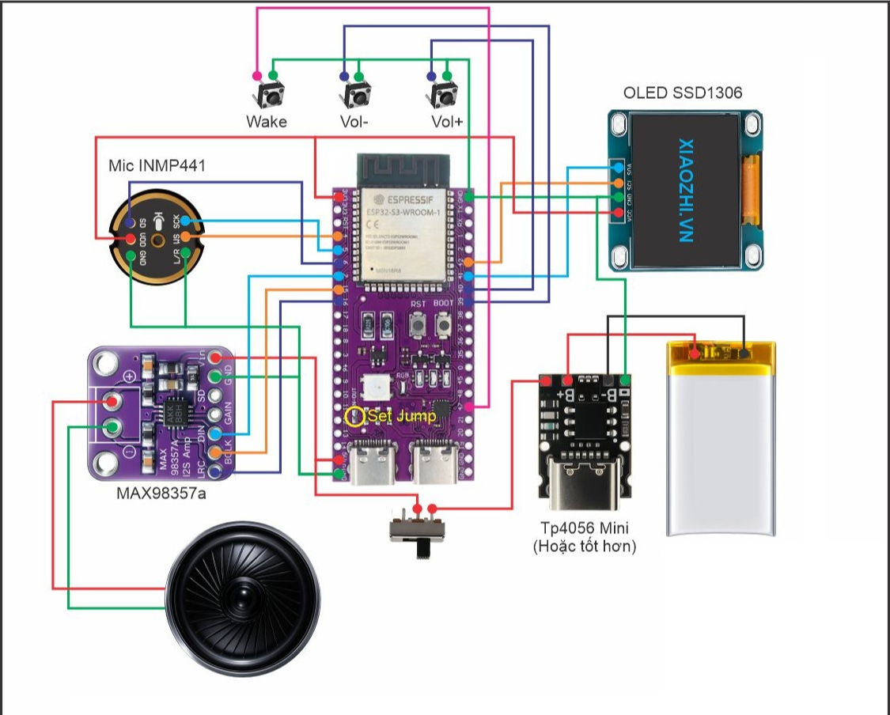
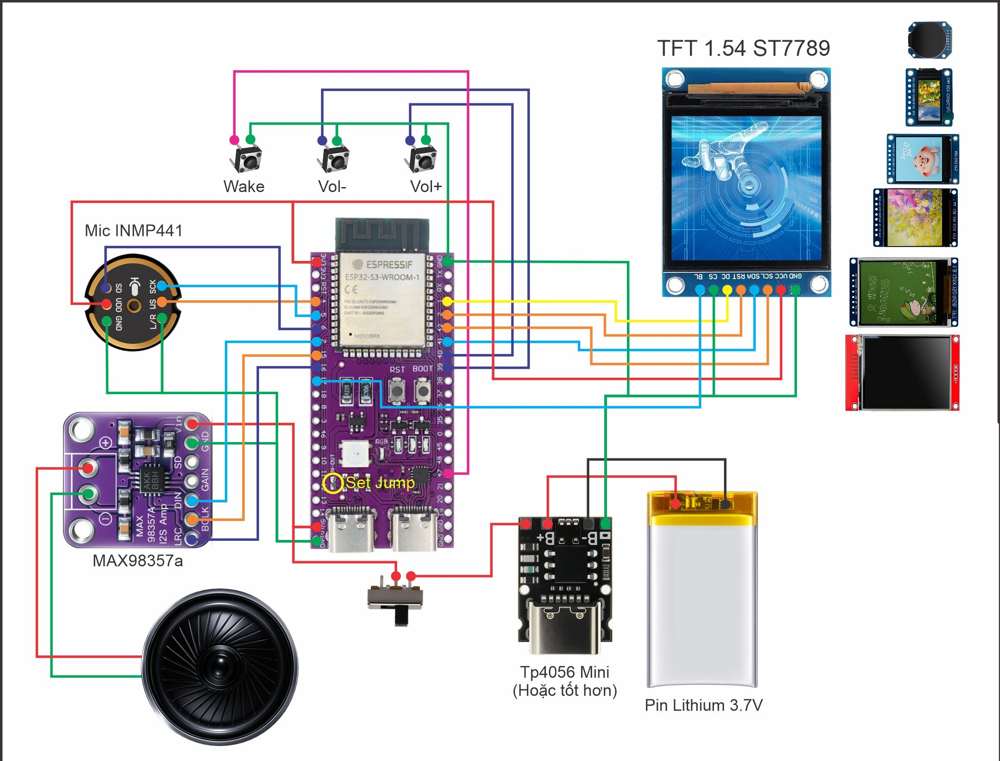

# esp32-assistant

ESP-IDF firmware that turns an ESP32-S3 or ESP32-C3 board (INMP441 mic + MAX98357A amp,
optional OLED/TFT) into a hands-free voice assistant terminal for the gateway in this monorepo.

The device is a **thin client**: it captures microphone audio, compresses it with Opus at 16 kHz,
and streams the frames to the gateway over WebSocket. The gateway handles speech recognition,
language-model inference, and text-to-speech synthesis, then streams Opus audio back at 16 kHz
for the speaker. No STT, LLM, or TTS runs on the device.

Operation is **hands-free** (the server detects speech boundaries with VAD) and **half-duplex**
(the microphone is silenced while the speaker is playing).

---

## Hardware

- **SoC:** ESP32-S3 (dual-core, PSRAM) or ESP32-C3 (single-core, no PSRAM).
- **Mic:** INMP441 (I2S MEMS microphone) — wire `L/R → GND` for the LEFT slot.
- **Speaker:** MAX98357A (I2S class-D amp).
  - **S3** uses two I2S controllers (mic on I2S0, speaker on I2S1).
  - **C3** has one I2S controller, so mic and speaker run as two *simplex* channels on it,
    each with its own BCLK/WS pins.
- **Display (optional, auto-detected):** SSD1306 (I2C) if it ACKs, else ST7789 (SPI) on the
  same physical pins. A board with no panel runs headless.

Boards are auto-globbed from `components/boards/<name>/board_def.c` and selected by
`CONFIG_AA_BOARD_*` (see **Boards & wiring** below). Each board declares its own mic/speaker/
display/button pins, so you pick a board instead of editing global pin defaults.

---

## Boards & wiring

| Board | `CONFIG_AA_BOARD_*` | Notes |
|-------|---------------------|-------|
| `lugo-c3-devkit` | `AA_BOARD_LUGO_C3_DEVKIT` | ESP32-C3-DevKitM-1, single-I2S simplex audio |
| `lugo-s3-nx` | `AA_BOARD_LUGO_S3_NX` | ESP32-S3 N-series modules (N16R8 / N8R8 …), dual-I2S audio |
| `lugo-c3-supermini` / `lugo-s3-supermini` / `lugo-s3-wroom` | *(opt-in)* | foundation boards |

Pins live in each board's `board_def.c`. Current defaults:

**ESP32-C3 (`lugo-c3-devkit`)** — INMP441 SCK→GPIO1, WS→GPIO2, SD→GPIO10, L/R→GND;
MAX98357A BCLK→GPIO7, LRC→GPIO3, DIN→GPIO6; SSD1306 SCL→GPIO5, SDA→GPIO4.




**ESP32-S3 (`lugo-s3-nx`)** — INMP441 WS→GPIO4, SCK→GPIO5, SD→GPIO6, L/R→GND;
MAX98357A BCLK→GPIO15, LRC→GPIO16, DIN→GPIO7; display SCL/SDA (or SCLK/MOSI)→GPIO42/41
(ST7789 also DC→GPIO1, RST→GPIO2, BL→GPIO17); buttons wake/vol±/emotion→GPIO47/40/39/46.




---

## Prerequisites

- **ESP-IDF v5.x** — `idf.py` must be on your PATH and the IDF environment sourced.
  Install from https://docs.espressif.com/projects/esp-idf/

No other host tooling is required to build and flash.

---

## Configure

```bash
idf.py set-target esp32s3   # or: idf.py set-target esp32c3
idf.py menuconfig
```

Navigate to **"Assistant configuration"** and set:

WiFi credentials are no longer set here — see **WiFi provisioning** below. STT
engine / TTS voice / language / LLM all come from the server-side **profile**
(`AA_PROFILE`), not compile-time options. Audio/display pins come from the
selected **board** (see **Boards & wiring**), not from this table.

| Option | Key | Default | Notes |
|--------|-----|---------|-------|
| Target board | `AA_BOARD_*` | auto-detect | Pick your board, or leave auto-detect (multi-board single binary) |
| Gateway host | `AA_SERVER_HOST` | `192.168.1.50` | IP or domain |
| Gateway port | `AA_SERVER_PORT` | `8000` | |
| Use wss:// (TLS) | `AA_SERVER_SECURE` | off | Enable for production |
| Chatllm profile (optional) | `AA_PROFILE` | *(empty)* | Named profile from `POST /v1/profiles` — bundles STT engine + language, TTS voice, LLM model/system prompt, MCP tools, memory. Empty → server `.env` defaults |

Mic/speaker/display/button pins are defined per board in
`components/boards/<name>/board_def.c` — **pick the board that matches your wiring** rather than
editing global pin defaults.

> **Per-device pairing (the only path).** The device gets its own token through
> the server pairing flow rather than a shared secret. On boot it resolves a
> token in this order: token stored in NVS → **run pairing**. Pairing calls
> `POST /v1/devices/pair/init` (serial = eFuse MAC), shows an 8-digit code on the
> display (and logs it), polls `GET /v1/devices/pair/status` every 3s until a
> logged-in user claims the code in the web Devices screen, then persists the
> per-device token to NVS and connects with `?device_token=` on
> `/v1/lugo/stream` (see [`resolve_ws_identity`](../apps/api_gateway/app/core/auth_guard.py)
> and [`routes/devices.py`](../apps/api_gateway/app/api/routes/devices.py)).
>
> **Revocation.** Removing the device in the web UI revokes its token; the next
> connection is rejected (WS handshake 401/403) or the server sends a `goodbye`
> with `reason=account_disabled`. The device then wipes the NVS token and
> re-enters pairing (showing a fresh code). Ordinary network drops, ping
> timeouts, and idle `goodbye`s keep the token and just reconnect.
>
> There is no build-time token override any more. `AA_DEVICE_TOKEN` used to sit
> in front of both steps, and because it lived in the image rather than in NVS a
> revoked override could never be re-paired away — both revocation paths needed
> a special case to skip themselves whenever it was set. The gateway still
> accepts the legacy shared `DEVICE_AUTH_TOKEN` env var as a fallback.

---

## WiFi provisioning

The device has no compile-time WiFi credentials. On every boot it tries to
connect using whatever SSID/password is saved in NVS. If nothing is saved yet
(first boot), or the saved credentials fail to connect within 15 seconds, the
device switches into **provisioning mode**:

1. It scans for nearby networks **first**, while the radio is still in station
   mode, and keeps the list. (This has to happen before the AP comes up: a scan
   needs a station interface, and running the portal as AP+STA starves the
   beacon and makes `Lugo-XXXX` unfindable.)
2. It starts an open WiFi access point named `Lugo-XXXX` (`XXXX` = the last
   4 hex digits of the device's MAC address — stable across reboots, so it's
   always the same network name for a given device).
3. Connect a phone or laptop to that network. Most OSes will pop up a
   "Sign in to network" / captive-portal prompt automatically; if not,
   browse to `http://192.168.9.1`.
4. Tap your network in the list — that fills the name field, so all you type is
   the password. Networks are de-duplicated by name and sorted strongest-first,
   each row showing signal strength and whether it is secured. Hidden networks
   are not listed; type the name into the field instead.
5. Set the gateway host/port and submit. The device saves to NVS and restarts,
   this time connecting to your WiFi and the gateway.

The list is a snapshot taken at portal start, so there is no rescan button — if
a network appears later, reboot the device or type its name in directly.

To reconfigure later (new WiFi network, moved gateway), the easiest path is
to erase NVS and reboot so it goes straight back into provisioning mode:

```bash
source ~/esp/esp-idf/export.sh
idf.py -p <port> erase-flash
idf.py -p <port> flash
```

---

## Build, flash, and monitor

```bash
idf.py build flash monitor
```

On first build, `idf.py reconfigure` resolves the managed components (`78/esp-opus`,
`espressif/esp_codec_dev`, `espressif/esp_websocket_client`). This requires an internet connection.

Expected serial output after a successful boot:

```
I (xxx) app: esp32-assistant booting
I (xxx) wifi_sta: connected
I (xxx) app: session ready
I (xxx) app: running
```

Once `session ready` appears the device is streaming. Speak; the server VAD will detect the
utterance boundary and the gateway will reply with synthesised audio.

---

## Sanity-check the server first

Before flashing, verify that the gateway is reachable and working by opening its browser
playground at `http://<host>:<port>/ui`. Go to the **Conversation** tab, enable
**Opus downlink**, and speak into your browser microphone. If the round-trip works there, the
device will work too.

---

## Protocol

The firmware connects to:

```
ws[s]://host:port/v1/conversation/stream
    ?stt_engine=…&tts_engine=…&language=…
    &sample_rate=16000&audio_codec=opus
    &output=audio,text&audio_out=opus&output_sample_rate=16000
    [&profile=…]
```

**Uplink (device → gateway):** raw Opus binary frames, one WebSocket binary message per 60 ms
frame (960 samples at 16 kHz).

**Downlink (gateway → device):** Opus binary frames at 16 kHz / 60 ms (960 samples), and JSON
text frames carrying lifecycle events (`session_started`, `speech_start`, `speech_end`,
`audio_start`, `audio_end`, `turn_done`, `aborted`, `user_transcript`, `response_text`, `error`).

For the full protocol specification, see
[`../agent-assistant/integration.md`](../agent-assistant/integration.md).

**Profiles (chatllm presets):** the gateway can bundle LLM model/system prompt/TTS/MCP
tools/memory into a named **profile** (`POST /v1/profiles`) and activate it with
`?profile=<name>` on the WS URL — see
[`../docs/device-integration.md`](../docs/device-integration.md#1a-profiles-connect-a-device-as-a-preset-chatllm-persona).
Set **`AA_PROFILE`** in `menuconfig` → "Assistant configuration" (empty by default = no
profile sent). When set, it's sent in the Lugo `wakeup` handshake; the profile owns the STT
engine + language, TTS voice, LLM, MCP tools and memory server-side (empty → the server's
`.env` defaults). The Raspberry Pi clients
(`scripts/rpi_voice_client.py --profile <name>` and `agent-assistant/`'s
`session.profile` in `config.yaml`) support the same param.

---

## Components

| Component | Description |
|-----------|-------------|
| `wifi` | WiFi STA init and reconnect; exposes `wifi_sta_start` / `wifi_sta_wait_connected` |
| `provisioning` | SoftAP + captive DNS + HTTP config portal (`provisioning_start`); host-tested SSID/form logic in `provisioning_ssid.c`/`provisioning_form.c` |
| `lugo_protocol` | Lugo wire codec: v3 binary frame encode/decode + JSON builders/parser (`wakeup`/`abort`/`text`; `welcome`/`stt`/`tts`/`goodbye`/`error`); **dependency-free** (plain C, no ESP-IDF) |
| `ws_client` | Thin wrapper around `esp_websocket_client`; connects to `/v1/lugo/stream`, sends the `wakeup` handshake, v3-decodes downlink audio, dispatches audio + Lugo JSON events to callbacks |
| `audio` | Board-facing `audio_mic_read` / `audio_spk_write` dispatching to the board's mic/speaker drivers: `i2s_mic` + `i2s_speaker` (S3 dual-I2S) or `i2s_fd` (C3 single-controller simplex) |
| `opus_codec` | Opus encoder (16 kHz, 60 ms, 1 ch) and decoder (16 kHz, 60 ms, 1 ch); wraps `78/esp-opus` |
| `main` | Application state machine (CONNECTING → LISTENING ↔ SPEAKING), jitter buffer (FreeRTOS queue of heap Opus packets), `mic_task` and `spk_task` |

---

## Host unit tests (no ESP-IDF required)

The `lugo_protocol` component is dependency-free and compiles on any POSIX host with a C11
compiler. To run its tests (and the other host-testable components):

```bash
cd test
make test
```

Expected output ends with `ALL PASS`. No ESP-IDF, no hardware, and no libraries beyond the
system C compiler (`cc`) are needed.

---

## Wokwi simulation (board/display/WiFi only, not voice)

This repo has a Wokwi setup (`wokwi.toml`, `diagram.json`) for running the firmware without
hardware — see [WOKWI.md](WOKWI.md) for the build steps, custom-chip compilation, and, importantly,
its limitations: Wokwi cannot simulate I2S at all (neither the chip API nor the ESP32-S3's own I2S
HAL), so mic/speaker are stubbed out and voice round-trip cannot be tested this way. It's useful
for board-autodetect, display, WiFi, and button-logic regressions only.

---

## Known limitations

**Opus managed component:** `idf_component.yml` requests `78/esp-opus: "*"` — the libopus
port from the xiaozhi author, which exposes the standard `opus.h` API. This is verified to
resolve and build against ESP-IDF v5.4. (`espressif/opus` and `chmorgan/esp-libopus` do NOT
exist in the registry.)

**16 kHz Opus both ways:** mic uplink and speaker downlink both run at 16 kHz. On the S3 the mic
(I2S0) and speaker (I2S1) are independent; on the C3 they share the single I2S controller as two
simplex channels. Downlink TTS is paced to real time by the gateway (`conversation_opus_pace`),
so the device only needs a small jitter buffer.

**`lugo_protocol` JSON parser:** the parser is a minimal key-scanner tuned to the gateway's flat
Lugo event objects, not a general-purpose JSON parser. It assumes a trusted gateway — malformed or
deeply nested JSON is not a supported input.

---

## Out of scope (MVP)

The following features are not implemented and are not planned for the initial release:

- OLED or display output
- On-device wake-word detection
- OTA firmware updates
- Push-to-talk mode
